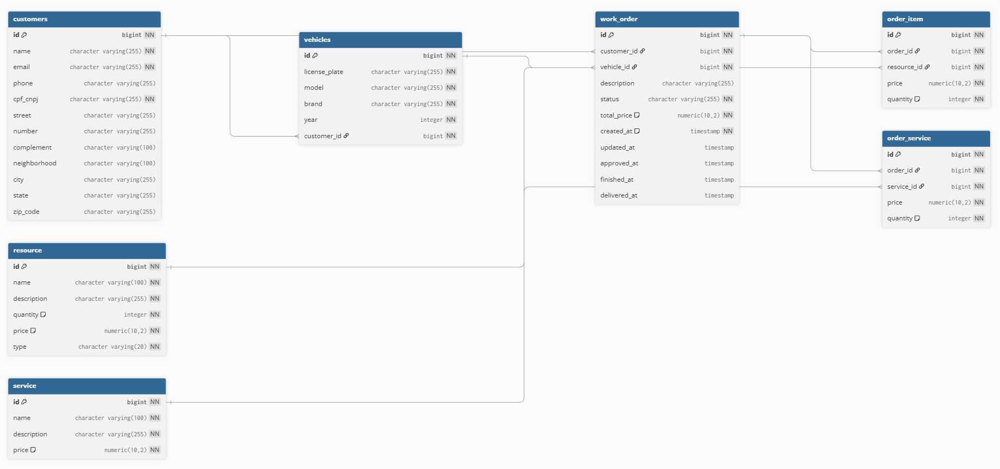
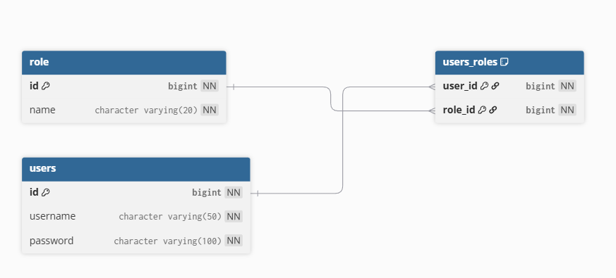

# Explicação do Diagrama Entidade-Relacionamento (ER)

Este documento explica de forma simples o **Diagrama Entidade-Relacionamento (ER)**
do banco de dados da aplicação do Tech Challenge, baseado exatamente nas tabelas
existentes no modelo. O objetivo é facilitar o entendimento do banco por todos os
integrantes do grupo e deixar claro como as tabelas se relacionam.

---

## Visão Geral do Modelo

O banco de dados foi modelado para representar uma **oficina mecânica**, incluindo:

- Usuários e permissões de acesso
- Clientes e seus veículos
- Ordens de serviço
- Serviços realizados
- Recursos (peças e insumos) utilizados

O modelo segue o padrão **relacional**, usando chaves primárias e estrangeiras para
garantir integridade e organização dos dados.

---

## Tabelas de Usuário e Permissão

### ROLE
A tabela **ROLE** armazena os tipos de perfil do sistema, como `ADMIN` e `USER`.

Ela permite controlar permissões sem duplicar informação em outras tabelas.

---

### USERS
A tabela **USERS** representa os usuários do sistema (login).

Principais dados:
- Username
- Senha (armazenada de forma criptografada)

Essa tabela é usada principalmente para autenticação e controle de acesso.

---

### USERS_ROLES (Relacionamento N:N)

A tabela **USERS_ROLES** faz a ligação entre usuários e papéis (roles).

- Um usuário pode ter **mais de uma role**
- Uma role pode estar associada a **vários usuários**

Essa tabela resolve o relacionamento **muitos-para-muitos**, mantendo o modelo
flexível e organizado.

---

## Tabelas de Clientes e Veículos

### CUSTOMERS
A tabela **CUSTOMERS** representa os clientes da oficina, podendo ser pessoas
físicas ou jurídicas.

Principais informações:
- Nome
- CPF ou CNPJ (único)
- Contato
- Endereço

Ela é a base para o relacionamento com veículos e ordens de serviço.

---

### VEHICLES
A tabela **VEHICLES** representa os veículos cadastrados no sistema.

- Cada veículo pertence a **um cliente**
- Um cliente pode ter **vários veículos**

Esse relacionamento permite identificar facilmente quem é o dono de cada veículo.

---

## Tabelas de Serviços e Recursos

### SERVICE
A tabela **SERVICE** armazena os tipos de serviços oferecidos pela oficina, como
troca de óleo, alinhamento ou revisão.

Ela funciona como um catálogo de serviços, com nome, descrição e preço base.

---

### RESOURCE
A tabela **RESOURCE** representa os recursos usados nos serviços, como peças e
insumos.

Exemplos:
- Peças (pastilhas de freio, pneus)
- Insumos (óleo, fluido)

O campo `type` diferencia o tipo de recurso.

---

## Tabelas de Ordem de Serviço

### WORK_ORDER
A tabela **WORK_ORDER** é a principal do sistema.

Ela representa cada atendimento realizado pela oficina e se relaciona com:
- Cliente
- Veículo

Principais informações:
- Descrição do problema ou serviço
- Status da ordem
- Valor total
- Datas importantes (criação, aprovação, finalização, entrega)

Essa tabela centraliza o fluxo do negócio.

---

### ORDER_SERVICE
A tabela **ORDER_SERVICE** relaciona uma ordem de serviço com os serviços realizados.

- Uma ordem pode ter **vários serviços**
- Um serviço pode aparecer em **várias ordens**

Essa tabela permite detalhar o que foi feito em cada ordem.

---

### ORDER_ITEM
A tabela **ORDER_ITEM** relaciona uma ordem de serviço com os recursos utilizados.

- Uma ordem pode usar **vários recursos**
- Um recurso pode ser usado em **várias ordens**

Ela é usada para controlar peças, insumos e quantidades utilizadas.

---

## Relacionamentos Principais (Resumo)

- **CUSTOMERS 1 → N VEHICLES**
- **CUSTOMERS 1 → N WORK_ORDER**
- **VEHICLES 1 → N WORK_ORDER**
- **WORK_ORDER 1 → N ORDER_SERVICE**
- **WORK_ORDER 1 → N ORDER_ITEM**
- **SERVICE 1 → N ORDER_SERVICE**
- **RESOURCE 1 → N ORDER_ITEM**
- **USERS N ↔ N ROLE** (via USERS_ROLES)

---

## Considerações Finais

- O modelo evita duplicação de dados
- Os relacionamentos refletem o funcionamento real da oficina
- A separação das tabelas facilita o entendimento do banco
- O modelo é fácil de integrar com a aplicação e APIs
- Permite evolução futura sem grandes mudanças estruturais

Esse ER foi pensado para ser **simples de entender**, **organizado** e adequado
para um projeto acadêmico em grupo.

## Diagrama Entidade Relacionamento






Conteúdo para importação e manutenção do diagrama no https://dbdiagram.io/

```
Table "customers" {
  "id" bigint [pk, not null]
  "name" "character varying(255)" [not null]
  "email" "character varying(255)" [not null]
  "phone" "character varying(255)"
  "cpf_cnpj" "character varying(255)" [unique, not null]
  "street" "character varying(255)"
  "number" "character varying(255)"
  "complement" "character varying(100)"
  "neighborhood" "character varying(100)"
  "city" "character varying(255)"
  "state" "character varying(255)"
  "zip_code" "character varying(255)"
}

Table "order_item" {
  "id" bigint [pk, not null]
  "order_id" bigint [not null]
  "resource_id" bigint [not null]
  "price" numeric(10,2) [not null]
  "quantity" integer [not null, default: 1]
}

Table "order_service" {
  "id" bigint [pk, not null]
  "order_id" bigint [not null]
  "service_id" bigint [not null]
  "price" numeric(10,2) [not null]
  "quantity" integer [not null, default: 1]
}

Table "resource" {
  "id" bigint [pk, not null]
  "name" "character varying(100)" [not null]
  "description" "character varying(255)" [not null]
  "quantity" integer [not null, default: 0]
  "price" numeric(10,2) [not null, default: 0.00]
  "type" "character varying(20)" [not null]
}

Table "role" {
  "id" bigint [pk, not null]
  "name" "character varying(20)" [unique, not null]
}

Table "service" {
  "id" bigint [pk, not null]
  "name" "character varying(100)" [not null]
  "description" "character varying(255)" [not null]
  "price" numeric(10,2) [not null, default: 0.00]
}

Table "users" {
  "id" bigint [pk, not null]
  "username" "character varying(50)" [unique, not null]
  "password" "character varying(100)" [not null]
}

Table "users_roles" {
  "user_id" bigint [not null]
  "role_id" bigint [not null]

  Indexes {
    (user_id, role_id) [pk, name: "users_roles_pkey"]
  }
}

Table "vehicles" {
  "id" bigint [pk, not null]
  "license_plate" "character varying(255)" [unique, not null]
  "model" "character varying(255)" [not null]
  "brand" "character varying(255)" [not null]
  "year" integer [not null]
  "customer_id" bigint [not null]
}

Table "work_order" {
  "id" bigint [pk, not null]
  "customer_id" bigint [not null]
  "vehicle_id" bigint [not null]
  "description" "character varying(255)"
  "status" "character varying(255)" [not null]
  "total_price" numeric(10,2) [not null, default: 0.00]
  "created_at" timestamp [not null, default: `CURRENT_TIMESTAMP`]
  "updated_at" timestamp
  "approved_at" timestamp
  "finished_at" timestamp
  "delivered_at" timestamp
}

Ref "order_item_order_id_fkey":"work_order"."id" < "order_item"."order_id" [delete: cascade]

Ref "order_item_resource_id_fkey":"resource"."id" < "order_item"."resource_id"

Ref "order_service_order_id_fkey":"work_order"."id" < "order_service"."order_id" [delete: cascade]

Ref "order_service_service_id_fkey":"service"."id" < "order_service"."service_id"

Ref "users_roles_role_id_fkey":"role"."id" < "users_roles"."role_id" [delete: cascade]

Ref "users_roles_user_id_fkey":"users"."id" < "users_roles"."user_id" [delete: cascade]

Ref "vehicles_customer_id_fkey":"customers"."id" < "vehicles"."customer_id"

Ref "work_order_customer_id_fkey":"customers"."id" < "work_order"."customer_id"

Ref "work_order_vehicle_id_fkey":"vehicles"."id" < "work_order"."vehicle_id"
```